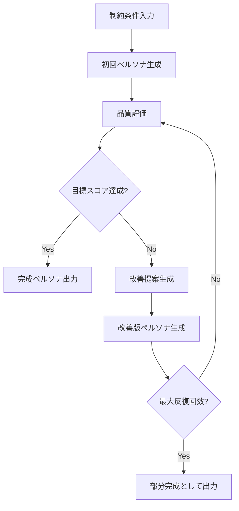

# 🧠 UPPS ペルソナ自動生成システム v1.0

**CSV形式の制約条件から複数のUPPS 2025.2準拠ペルソナを自動生成するブラウザベースアプリケーション**

---

## 📋 目次

- [概要](#概要)
- [主要機能](#主要機能)
- [クイックスタート](#クイックスタート)
- [⚠️ CORS問題について](#️-cors問題について)
- [詳細な使用方法](#詳細な使用方法)
- [技術仕様](#技術仕様)
- [トラブルシューティング](#トラブルシューティング)
- [制限事項](#制限事項)
- [セキュリティ](#セキュリティ)
- [既知の課題](#既知の課題)
- [コントリビューション](#コントリビューション)
- [ライセンス](#ライセンス)

---

## 概要

UPPS ペルソナ自動生成システムは、AI精神療法システムの検証や人間治療者の訓練を目的として開発されたWebアプリケーションです。CSV形式で指定された制約条件に基づいて、医学的・心理学的に妥当なUPPS（Unified Personality Profile Standard）2025.2準拠のペルソナを自動生成します。

### 🎯 プロジェクトの背景

- **AI精神療法システムの検証**: 多様な精神科疾患をカバーするペルソナセットによる包括的テスト
- **人間治療者訓練**: 段階的スキル習得を支援する教育用ペルソナの提供
- **標準化**: ICD-11/DSM-5-TR準拠の標準化されたペルソナセット構築
- **効率化**: LLM駆動による従来比75%の開発工数削減

---

## 主要機能

### 🚀 核心機能

- **📁 一括処理**: CSVファイルからの複数制約条件の同時処理
- **🔄 品質向上ループ**: 自動品質チェック＆改善提案による反復的品質向上
- **📝 カスタマイズ可能プロンプト**: 生成・評価プロンプトテンプレートの編集機能
- **📊 リアルタイム監視**: 生成進捗、品質スコア、エラー状況のリアルタイム表示
- **💾 結果管理**: 個別・一括ダウンロード、サマリーCSV出力

### 🎛️ ユーザーインターフェース

- **⚙️ 設定タブ**: API設定、品質目標、反復回数の設定
- **📁 ファイルタブ**: CSV管理、サンプルダウンロード、ドラッグ&ドロップ対応
- **📝 プロンプトタブ**: テンプレート編集、デフォルト復元機能
- **🚀 生成タブ**: 一括実行、進捗表示、ログ管理
- **📊 結果タブ**: 統計表示、詳細確認、ファイル出力

---

## クイックスタート

### 1. **ファイルを開く**
```
HTMLファイルをChromeで開く
```

### 2. **APIキー設定**
```
⚙️設定タブ → OpenAI API Key入力 → 設定保存
```

### 3. **制約条件準備**
```csv
id,constraints
persona_001,"25歳日本人男性、社交不安障害、IT関連職、完璧主義的傾向"
persona_002,"30代女性、うつ病、元看護師、2児の母"
persona_003,"40代男性、PTSD、元自衛官、アルコール依存症併発"
```

### 4. **ファイルアップロード**
```
📁ファイルタブ → CSVドラッグ&ドロップ
```

### 5. **生成実行**
```
🚀生成タブ → ペルソナ生成開始
```

### 6. **結果確認**
```
📊結果タブ → 詳細確認 → ダウンロード
```

---

## ⚠️ CORS問題について

### 🚨 重要な制限事項

このアプリケーションは**OpenAI APIを直接呼び出す**ため、ブラウザの**CORS（Cross-Origin Resource Sharing）制限**により実際のAPI呼び出しが失敗する可能性があります。

#### CORS制限とは？
```
ブラウザ → OpenAI API (異なるドメイン間の通信)
    ↓
❌ セキュリティ制限により通信ブロック
```

### 🛠️ 解決方法

以下の3つの方法から選択してください：

#### **方法1: Chrome CORS無効化起動（推奨・開発用）**

**Windows:**
```batch
"C:\Program Files\Google\Chrome\Application\chrome.exe" --disable-web-security --user-data-dir=%TEMP%\upps_chrome
```

**macOS:**
```bash
open -n -a /Applications/Google\ Chrome.app/Contents/MacOS/Google\ Chrome --args --user-data-dir="/tmp/upps_chrome" --disable-web-security
```

**Linux:**
```bash
google-chrome --disable-web-security --user-data-dir="/tmp/upps_chrome"
```

**⚠️ セキュリティ警告:**
- 開発・テスト用途のみ使用
- 一般的なWebブラウジングには使用禁止
- 作業完了後は通常のChromeに戻す

#### **方法2: ブラウザ拡張機能**
1. Chrome Web Storeから「CORS Unblock」または「Allow CORS」をインストール
2. 拡張機能を有効化
3. アプリを使用

#### **方法3: プロキシサーバー構築（本格運用用）**
```javascript
// server.js
const express = require('express');
const cors = require('cors');
const app = express();

app.use(cors());
app.use(express.json());

app.post('/api/openai', async (req, res) => {
    const response = await fetch('https://api.openai.com/v1/chat/completions', {
        method: 'POST',
        headers: {
            'Authorization': `Bearer ${process.env.OPENAI_API_KEY}`,
            'Content-Type': 'application/json'
        },
        body: JSON.stringify(req.body)
    });
    
    const data = await response.json();
    res.json(data);
});

app.listen(3001);
```

### 🎭 デモモード

CORS制限でAPI呼び出しが失敗した場合、アプリは自動的に**デモモード**に切り替わります：

- **模擬ペルソナ生成**: 実際のGPT-4の代わりに模擬データを生成
- **品質評価**: 60-100点のランダムスコア
- **完全な動作確認**: UIやワークフローの確認が可能

---

## 詳細な使用方法

### ⚙️ システム設定

| 設定項目 | 説明 | 推奨値 |
|---------|------|-------|
| OpenAI API Key | APIアクセスキー | sk-proj-... |
| 目標品質スコア | 生成品質の閾値 | 80点 |
| 最大反復回数 | 改善試行回数 | 3回 |

### 📁 制約条件ファイル形式

#### **必須列**
- `id`: ペルソナの一意識別子
- `constraints`: 制約条件（自然言語）

#### **制約条件の例**
```csv
id,constraints
basic_anxiety,"20代男性、軽度の社交不安障害"
complex_case,"35歳女性、双極性障害I型、育児ストレス、夫との関係悪化"
ptsd_veteran,"40代男性、戦闘関連PTSD、アルコール使用障害併発、失業中"
elderly_depression,"70代女性、配偶者死別による適応障害、軽度認知機能低下疑い"
```

### 📝 プロンプトテンプレート

#### **生成プロンプト変数**
- `{constraints}`: 制約条件
- `{iteration}`: 現在の反復回数

#### **品質チェックプロンプト変数**
- `{persona_draft}`: 生成されたペルソナドラフト
- `{constraints}`: 元の制約条件

#### **カスタマイズ例**
```
## 特定領域に特化した生成

### PTSD専門版
制約条件: {constraints}

PTSD関連の以下の点に特に注意してペルソナを生成：
1. トラウマ体験の具体性と影響
2. 症状の重症度レベル
3. 回避行動パターン
4. 社会機能への影響度
...
```

### 🚀 生成プロセス



### 📊 結果の解釈

#### **ステータス種別**
- **✅ completed**: 目標スコア達成
- **⚠️ max_iterations_reached**: 反復上限到達
- **❌ error**: 生成エラー

#### **品質スコア内訳**
- **医学的妥当性** (25点): 症状・診断の正確性
- **心理学的整合性** (25点): 性格・行動の一貫性
- **UPPS規格準拠性** (25点): 技術的適合性
- **教育的価値** (25点): 訓練・研究での有用性

---

## 技術仕様

### 🏗️ アーキテクチャ

```
[ブラウザUI] → [JavaScript] → [OpenAI API] → [ペルソナ生成]
     ↓              ↓              ↓              ↓
[ファイル管理] → [品質評価] → [改善ループ] → [結果出力]
```

### 💻 技術スタック

- **フロントエンド**: HTML5, CSS3, Vanilla JavaScript
- **API統合**: Fetch API, OpenAI GPT-4 Turbo
- **データ処理**: CSV parsing, YAML generation
- **ストレージ**: セッションメモリ（localStorage無効環境対応）

### 📋 UPPS 2025.2 準拠項目

| カテゴリ | 項目 | 説明 |
|---------|------|------|
| personal_info | 基本情報 | 氏名、年齢、性別、職業等 |
| background | 背景情報 | 成育歴、生活背景の詳細 |
| personality | 性格特性 | BigFive理論による数値化 |
| emotion_system | 感情システム | Ekmanモデルによる感情ベースライン |
| memory_system | 記憶システム | エピソード・意味・手続き記憶 |
| association_system | 関連システム | 感情と記憶の相互作用 |
| cognitive_system | 認知システム | WAIS-IV準拠の認知能力 |

### ⚡ パフォーマンス

- **生成時間**: 1ペルソナあたり30-120秒
- **API呼び出し**: 1ペルソナあたり最大6回（生成3回+評価3回）
- **推定コスト**: 1ペルソナあたり$1-3（GPT-4 Turbo使用時）

---

## トラブルシューティング

### 🐛 よくある問題

#### **1. APIキーエラー**
```
❌ "OpenAI API Keyが設定されていません"
```
**解決策:**
- 設定タブでAPIキーを確認
- `sk-proj-`または`sk-`で始まる正しい形式か確認
- OpenAIアカウントの残高確認

#### **2. CORS エラー**
```
❌ "Access to fetch blocked by CORS policy"
```
**解決策:**
- Chrome CORS無効化起動（上記参照）
- ブラウザ拡張機能使用
- デモモードでの動作確認

#### **3. CSV読み込みエラー**
```
❌ "CSVファイルには id と constraints の列が必要です"
```
**解決策:**
- ファイル形式確認（UTF-8エンコーディング）
- 必須列の存在確認
- サンプルCSVとの比較

#### **4. 品質スコア低下**
```
⚠️ "品質スコアが目標を下回っています"
```
**解決策:**
- 制約条件の詳細化
- プロンプトテンプレートの調整
- 目標スコアの見直し

#### **5. 生成停止・エラー**
```
❌ "Generation failed after multiple attempts"
```
**解決策:**
- API制限確認（レート制限・残高）
- インターネット接続確認
- ブラウザコンソールでのエラー詳細確認

### 🔧 デバッグ手順

1. **ブラウザデベロッパーツール開く**
   ```
   F12キー または Ctrl+Shift+I
   ```

2. **コンソールタブでエラー確認**
   ```javascript
   // CORS確認テスト
   fetch('https://api.openai.com/v1/models')
   .then(response => console.log('CORS OK'))
   .catch(error => console.log('CORS Error:', error));
   ```

3. **ネットワークタブでAPI呼び出し確認**
   - 失敗したリクエストの詳細
   - レスポンスコードとメッセージ

---

## 制限事項

### 🚧 現在の制限

#### **技術的制限**
- **ブラウザ制限**: localStorage/sessionStorage無効環境での動作
- **CORS制限**: 直接API呼び出しの制約
- **セッション限定**: ページリロードでデータ消失
- **単一スレッド**: 同時生成不可（順次処理のみ）

#### **機能的制限**
- **言語**: 主に日本語制約条件に最適化
- **AIモデル**: OpenAI GPT-4系のみ対応
- **ファイル形式**: CSV入力、YAML出力のみ
- **認証**: 基本認証機能なし

#### **コスト制限**
- **API料金**: ユーザー負担
- **レート制限**: OpenAI APIの制限に依存
- **使用量管理**: 基本的な警告のみ

### 📊 スケーラビリティ

| 項目 | 制限値 | 推奨値 |
|------|-------|-------|
| 同時制約条件数 | 100件まで | 10-20件 |
| 1件あたり処理時間 | 最大5分 | 1-2分 |
| CSVファイルサイズ | 10MB以下 | 1MB以下 |
| 1日あたり処理数 | API制限に依存 | 50-100件 |

---

## セキュリティ

### 🔒 データ保護

#### **機密情報の取り扱い**
- **APIキー**: セッションメモリのみ保存、外部送信なし
- **ペルソナデータ**: ローカル処理、第三者送信なし
- **制約条件**: ブラウザ内処理のみ

#### **OpenAI APIとの通信**
- **暗号化通信**: HTTPS必須
- **データ保持**: OpenAI APIポリシーに準拠
- **ログ記録**: 基本的な使用量のみ

### ⚠️ セキュリティリスク

#### **CORS無効化時のリスク**
```
🚨 Chrome CORS無効化による潜在的リスク:
- 任意サイトからの情報取得可能
- クロスサイトリクエスト攻撃に脆弱
- セッション乗っ取りの可能性
```

#### **安全な使用のためのガイドライン**
1. **専用ブラウザセッション**: 開発用途のみに使用
2. **重要サイト回避**: 銀行・決済サイト等にアクセスしない
3. **作業完了後の清掃**: ブラウザプロセス終了・データ削除
4. **定期的な確認**: 通常ブラウザでの最終動作確認

### 🔐 推奨セキュリティ対策

#### **開発環境**
```bash
# 専用の開発用ブラウザ環境
chrome --disable-web-security \
       --user-data-dir="/tmp/upps_dev" \
       --disable-extensions \
       --no-first-run
```

#### **本番環境移行時**
- プロキシサーバー構築
- 適切な認証システム実装
- HTTPS対応
- セキュリティヘッダー設定

---

## 既知の課題

### 🚧 解決が必要な主要課題

#### **技術的課題**
- **CORS制限**: 直接API呼び出しによるブラウザ制限
- **データ永続化**: セッション限定のデータ保存
- **エラーハンドリング**: API障害時の詳細な情報提供不足
- **処理効率**: 順次処理による時間コスト

#### **ユーザビリティ課題**
- **設定の保持**: ページリロード時の設定消失
- **進捗の詳細化**: 生成プロセスの可視性向上
- **結果の比較**: 複数ペルソナの比較機能不足
- **エラー回復**: 失敗時の部分的リトライ機能不足

#### **運用課題**
- **コスト管理**: API使用量の詳細な監視機能不足
- **品質の一貫性**: 生成結果のバラツキ
- **スケーラビリティ**: 大量処理時のパフォーマンス低下

---

## コントリビューション

### 🤝 貢献方法

このプロジェクトは現在開発中のプロトタイプです。改善提案やバグレポートは歓迎します。

#### **バグレポート時に含める情報**
- 詳細な状況説明と再現手順
- スクリーンショットまたは動作ログ
- ブラウザ・OS情報
- 使用したCSVファイルの例（可能であれば）

#### **機能改善提案**
- 具体的な用途・背景の説明
- 期待される動作の詳細
- 現在の制限事項との関連

### 📝 開発に関する注意事項

#### **テスト環境**
- 主要ブラウザ（Chrome、Firefox、Safari、Edge）での動作確認
- CORS無効化・有効化両環境でのテスト
- エラーケース（API障害、ネットワーク切断等）の検証

---

## ライセンス

```
MIT License

Copyright (c) 2025 UPPS Persona Generator Project

Permission is hereby granted, free of charge, to any person obtaining a copy
of this software and associated documentation files (the "Software"), to deal
in the Software without restriction, including without limitation the rights
to use, copy, modify, merge, publish, distribute, sublicense, and/or sell
copies of the Software, and to permit persons to whom the Software is
furnished to do so, subject to the following conditions:

The above copyright notice and this permission notice shall be included in all
copies or substantial portions of the Software.

THE SOFTWARE IS PROVIDED "AS IS", WITHOUT WARRANTY OF ANY KIND, EXPRESS OR
IMPLIED, INCLUDING BUT NOT LIMITED TO THE WARRANTIES OF MERCHANTABILITY,
FITNESS FOR A PARTICULAR PURPOSE AND NONINFRINGEMENT. IN NO EVENT SHALL THE
AUTHORS OR COPYRIGHT HOLDERS BE LIABLE FOR ANY CLAIM, DAMAGES OR OTHER
LIABILITY, WHETHER IN AN ACTION OF CONTRACT, TORT OR OTHERWISE, ARISING FROM,
OUT OF OR IN CONNECTION WITH THE SOFTWARE OR THE USE OR OTHER DEALINGS IN THE
SOFTWARE.
```

---

## 参考情報

### 📚 関連リソース

- **OpenAI API**: [公式ドキュメント](https://platform.openai.com/docs)
- **UPPS標準**: Unified Personality Profile Standard 2025.2準拠
- **CORS について**: [MDN Web Docs - CORS](https://developer.mozilla.org/ja/docs/Web/HTTP/CORS)

### ⚠️ 免責事項

このソフトウェアは「現状のまま」提供され、明示的または暗示的な保証はありません。使用に伴うリスクはユーザーが負担します。生成されたペルソナは教育・研究目的での使用を想定しており、実際の医療診断や治療には使用しないでください。

---

*🧠 AI精神療法システムの安全性・有効性向上および人間治療者の訓練効率化に貢献することを目指して開発されたプロトタイプアプリケーションです。*

**作成日**: 2025年5月28日  
**バージョン**: v1.0  
**ステータス**: プロトタイプ版
